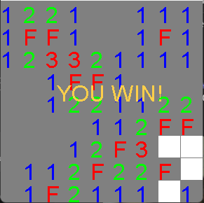

# About

This program is a recreation of the classic game [Minesweeper](https://en.wikipedia.org/wiki/Minesweeper_(video_game)) using pure Java.

## Difficulties

### Easy

9x9 grid with 11 mines.

### Medium

16x16 grid with 40 mines.

### Hard

30x16 grid with 99 mines.

## Controls

`left click` : Reveal a cell

`right click` : Flag a cell as a mine

`r` : Reset the board

`t` : Show timer

`escape` : Return to difficultly select