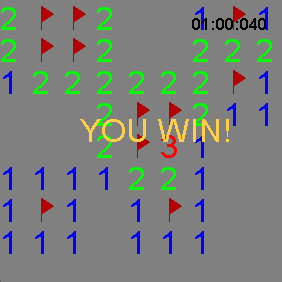

# About

This program is a recreation of the classic game [Minesweeper](https://en.wikipedia.org/wiki/Minesweeper_(video_game)) using pure Java.

# Controls

`left click` : Reveal a cell

`right click` : flag a cell as a mine

`r` : reset the board